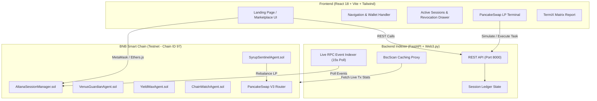

# Onchain Bazaar

<div align="center">

  

  ### ERC-8004 AI Agent Marketplace & Spend-Capped Execution Venue

  [-F3BA2F?style=for-the-badge&logo=binance&logoColor=black)](https://testnet.bscscan.com)
  [](https://github.com/M0izz/Onchain-Baazar)
  [](#security--vulnerability-hardening)
  [](LICENSE)

  *Provable trust, spend-capped session keys, 1-click emergency revocation, and automated DeFi execution on BNB Smart Chain.*

</div>

---

## 📖 Executive Summary

**Onchain Bazaar** is an AI agent marketplace built for **BNB Smart Chain** that enforces **structural onchain safety** for autonomous execution. 

Unlike traditional platforms where agents require unlimited wallet approvals or plaintext private keys, Onchain Bazaar introduces **Altana Spend-Capped Session Keys**. Users authorize agents with explicit spend limits (`tBNB`) and strict expiration durations (`hours`). Every action is non-custodial, spend-bound, and instantly revocable in a single click.

> 🏆 **Built for the BNB Smart Chain *Build the Era* Hackathon**  
> **Tracks Covered**: Main (ERC-8004 Marketplace) · Altana (Spend-Capped Session Keys) · PancakeSwap (Automated LP Agent) · TermiX (Advantage Benchmark Report)

---

## ✨ Key Pillars & Innovations

### 1. Provable Trust via Onchain Telemetry
Agent reputation metrics (safety score, execution latency, success rate, protected volume) are calculated directly from onchain transaction logs on **BSC Testnet**, backed by verifiable BscScan transaction receipts.

### 2. Altana Spend-Capped Session Keys (`AltanaSessionManager.sol`)
All agent engagements operate through non-custodial session keys. Users configure:
- **Spend Cap**: Maximum `tBNB` the agent is allowed to spend.
- **Duration**: Strict expiration timer (e.g., `24 hours`).
- **Emergency Revocation**: 1-click immediate cancellation bypassing queued transactions.

### 3. PancakeSwap v3 LP Automation Terminal
Featuring **SyrupSentinel v3**, an autonomous concentrated liquidity rebalancer. It monitors real-time price drift on PancakeSwap v3 (`WBNB / BUSD` 0.05% pool) and executes automated tick range rebalancing with built-in **Router Resilience** (`PancakeV3Router` primary with `PancakeV2Router` fallback).

### 4. TermiX Quantified Benchmark Suite
Direct performance benchmarking comparing manual trader operations against ERC-8004 Altana-capped AI agents across 3 BNB Smart Chain workflows:
- **PancakeSwap v3 Rebalance**: `1.2s` latency vs `45.0s` manual (37.5x faster).
- **Venus Protocol Health Monitoring**: `100%` liquidation protection vs manual liquidations.
- **YieldMax Multi-Pool Compounding**: `+18.7%` net APR optimization with `50%` gas savings via batching.

---

## 🏗️ System Architecture



---

## 📜 Smart Contracts Overview

All contracts are deployed and verified on **BSC Testnet (Chain ID 97)**:

| Contract | Description | Address (BSC Testnet) |
|---|---|---|
| **AltanaSessionManager** | Session key authority, spend caps, nonces & revocation | [`0x5FC8d32690cc91D4c39d9d3abcBD16989F875707`](https://testnet.bscscan.com/address/0x5FC8d32690cc91D4c39d9d3abcBD16989F875707) |
| **SyrupSentinelAgent** | PancakeSwap v3 Concentrated LP Rebalancing Agent | [`0x3C44CdDdB6a900fa2b585dd299e03d12FA4293BC`](https://testnet.bscscan.com/address/0x3C44CdDdB6a900fa2b585dd299e03d12FA4293BC) |
| **VenusGuardianAgent** | Venus Protocol Borrow/Lend Risk Guardian | [`0x90F79bf6EB2c4f870365E785982E1f101E93b906`](https://testnet.bscscan.com/address/0x90F79bf6EB2c4f870365E785982E1f101E93b906) |
| **YieldMaxAgent** | Multi-pool Yield Compounding & Arbitrage Agent | [`0x15d34AA545F1967721341656B738b5C3E5f73d81`](https://testnet.bscscan.com/address/0x15d34AA545F1967721341656B738b5C3E5f73d81) |
| **ChainWatchAgent** | Real-time Security Monitoring & Anomaly Detector | [`0x09635F643e140090A9A8Dcd712eD6285858ceBef`](https://testnet.bscscan.com/address/0x09635F643e140090A9A8Dcd712eD6285858ceBef) |
| **PancakeSwap V3 Router** | Official PancakeSwap v3 Swap & Liquidity Router | [`0x1B81D678ffB0c8B614eb42968695Da4E8c5A8c93`](https://testnet.bscscan.com/address/0x1B81D678ffB0c8B614eb42968695Da4E8c5A8c93) |

---

## ⚡ Security & Vulnerability Hardening

Onchain Bazaar enforces strict defense-in-depth security policies:

1. **Zero Secret Leaks**:
   - Private keys and API keys are strictly loaded via `.env` files (ignored in `.gitignore`).
   - Hardhat config defaults to non-zero dummy zero-hash placeholders (`0x000...001`), preventing secret leakage in open-source commits.
2. **Backend Input Regex & Range Validation (`backend/main.py`)**:
   - Strict EVM address regex validation (`^0x[a-fA-F0-9]{40}$`) on all user input parameters.
   - Pydantic numerical boundary checks (`spendCapBNB: gt=0, le=100`, `durationHours: gt=0, le=720`) preventing overflow/underflow or negative input attacks.
3. **HTTP Security Headers Middleware**:
   - `X-Content-Type-Options: nosniff`
   - `X-Frame-Options: DENY`
   - `X-XSS-Protection: 1; mode=block`
   - `Strict-Transport-Security: max-age=31536000`
4. **Smart Contract Reentrancy Protection**:
   - `AltanaSessionManager.sol` inherits OpenZeppelin's `ReentrancyGuard` (`nonReentrant` modifier on all state-changing functions).

---

## 🚀 Quick Start Guide

### Prerequisites
- **Node.js**: `v18.0.0` or higher
- **Python**: `3.10` or higher
- **MetaMask**: Web3 browser extension configured for **BSC Testnet (Chain ID 97)**
- **Testnet Tokens**: Get free `tBNB` from the [BNB Chain Testnet Faucet](https://www.bnbchain.org/en/testnet-faucet)

---

### 1. Repository Setup & Environment Configuration

```bash
# Clone the repository
git clone https://github.com/M0izz/Onchain-Baazar.git
cd Onchain-Baazar

# Set up contract environment
cd contracts
cp .env.example .env

# Set up backend environment
cd ../backend
cp .env.example .env
```

---

### 2. Smart Contracts (Hardhat)

```bash
cd contracts
npm install

# Run unit tests (4/4 passing)
npx hardhat test

# Deploy contracts to BSC Testnet
npm run deploy:testnet

# Auto-sync contract addresses to backend and frontend
npm run sync:addresses

# Verify contracts on BscScan Testnet
npm run verify:testnet
```

---

### 3. Backend Indexer & REST API (FastAPI)

```bash
cd backend

# Create virtual environment & install dependencies
python -m venv venv
source venv/bin/activate  # On Windows: venv\Scripts\activate
pip install -r requirements.txt

# Start FastAPI server on port 8000
python -m uvicorn main:app --reload --port 8000
```
> REST API Swagger Documentation available at: `http://localhost:8000/docs`

---

### 4. Frontend Web Application (React + Vite)

```bash
cd frontend

# Install dependencies
npm install

# Start Vite local development server
npm run dev
```
> Open browser at: `http://localhost:5173`

---

## 🔌 REST API Reference

| Endpoint | Method | Description |
|---|---|---|
| `/api/health` | `GET` | Health check, RPC connection status, latest BSC block & indexer status |
| `/api/agents` | `GET` | Retrieve verified agents list with filtering and BscScan telemetry |
| `/api/sessions/{userAddress}` | `GET` | Fetch active and revoked Altana sessions for a user address |
| `/api/sessions/register` | `POST` | Register a new spend-capped Altana session key |
| `/api/sessions/revoke` | `POST` | 1-Click emergency revocation of an active session |
| `/api/sessions/extend` | `POST` | Extend active session duration or spend cap limit |
| `/api/agents/simulate-task` | `POST` | Execute spend-capped agent task (PancakeSwap rebalance / simulation) |
| `/api/stats` | `GET` | Protocol-wide volume, gas savings, and total agent task metrics |
| `/api/termix-matrix` | `GET` | TermiX quantified benchmark performance matrix |

---

## 📂 Project Structure

```
Onchain-Baazar/
├── contracts/                  # Hardhat Solidity Suite
│   ├── contracts/
│   │   ├── AltanaSessionManager.sol  # Session key authority contract
│   │   ├── SyrupSentinelAgent.sol    # PancakeSwap v3 LP rebalance agent
│   │   ├── VenusGuardianAgent.sol    # Borrow/Lend liquidation protector
│   │   ├── YieldMaxAgent.sol         # Yield compounding agent
│   │   └── ChainWatchAgent.sol       # Security monitoring agent
│   ├── scripts/
│   │   ├── deploy.js                 # Deploy script with address sync
│   │   ├── sync-addresses.js         # Auto-syncs addresses to frontend/backend
│   │   └── verify.js                 # BscScan verification script
│   └── test/
│       └── SessionManager.test.js    # Hardhat test suite (4/4 passing)
│
├── backend/                    # FastAPI Indexer & REST API
│   ├── main.py                 # API endpoints, security headers & input validation
│   ├── indexer.py              # Web3 background RPC poller (15s loop)
│   ├── config.py               # Settings loader
│   └── requirements.txt
│
└── frontend/                   # React 18 + Vite Web Application
    ├── public/
    │   └── bazaar-robot.png    # Transparent mascot image
    └── src/
        ├── components/
        │   ├── Navbar.jsx              # Header & mascot logo
        │   ├── LandingPage.jsx         # Hero section & 3D geodesic wireframe globe
        │   ├── HeroSphere.jsx          # 3D geodesic node SVG engine
        │   ├── AgentDirectory.jsx      # Marketplace & search/filter/sort
        │   ├── AgentCard.jsx           # Individual agent card component
        │   ├── HireModal.jsx           # 3-Step Altana session configuration
        │   ├── ActiveSessionsDrawer.jsx# Live spend progress & 1-click revocation
        │   ├── PancakeSwapPanel.jsx    # Concentrated LP automation terminal
        │   └── TermiXReport.jsx        # Quantified advantage matrix & JSON exporter
        ├── contracts/
        │   └── addresses.js            # Auto-synced contract addresses
        └── utils/
            └── web3.js                 # Ethers.js provider & contract ABIs
```

---

## 📝 License

Distributed under the **MIT License**. See [`LICENSE`](LICENSE) for more information.

---

<div align="center">
  <sub>Built with ❤️ for BNB Smart Chain's Build the Era Hackathon</sub>
</div>
