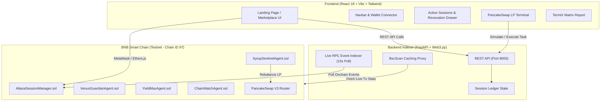

<div align="center">

  

  # Onchain Bazaar 

  > *"Hire Onchain. Cap the Spend. Revoke Anytime."*

  [](https://github.com/M0izz/Onchain-Baazar)
  [](https://www.bnbchain.org)
  [](https://github.com/M0izz/Onchain-Baazar)
  [](#altana-spend-capped-session-keys-engine)
  [](https://react.dev)
  [](https://fastapi.tiangolo.com)
  [](https://hardhat.org)

</div>

---

## Executive Overview

**Onchain Bazaar** is an onchain AI agent marketplace built for **BNB Smart Chain** that enforces **structural spend-capped safety** for autonomous agent execution. 

Unlike traditional platforms where agents require unlimited ERC-20 token approvals or private key access, Onchain Bazaar introduces **Altana Spend-Capped Session Keys**. Users delegate execution authority with explicit spend limits (`tBNB`) and strict expiration durations (`hours`). Every action is non-custodial, spend-bound, and instantly revocable in a single click.

The system features an **ERC-8004 Agent Registry**, an **Autonomous PancakeSwap v3 LP Automation Terminal**, real-time **BscScan Event Indexing**, side-by-side **Agent Attribute Comparison**, and a **TermiX Quantified Advantage Report** complete with onchain verification links.

---

## Key Features

- **4 Verified Autonomous AI Agents**: Specialized agents for PancakeSwap v3 LP range rebalancing, Venus borrow/lend protection, multi-pool yield compounding, and security monitoring.
- **Altana Spend-Capped Session Keys**: Non-custodial session keys configured with explicit `tBNB` spend caps, expiration timers, and 1-click emergency revocation.
- **PancakeSwap v3 LP Range Automation**: Autonomous concentrated liquidity management with dual router resilience (`PancakeV3Router` primary with `PancakeV2Router` fallback).
- **TermiX Advantage Matrix**: Direct performance benchmarks comparing manual human trading vs. AI agent execution with instant JSON telemetry export.
- **Real-Time Onchain Telemetry**: FastAPI RPC indexer polling BSC Testnet blocks every 15 seconds to index `SessionCreated`, `SessionExecuted`, and `SessionRevoked` events.
- **Retro Editorial Visual Design**: Custom 3D geodesic wireframe node globe SVG engine, paper background canvas, and Onchain Bazaar mascot branding.

---

## System Architecture & Workflow



---

## Smart Contracts & Onchain Verification

All smart contracts are compiled with Solidity `0.8.20`, deployed, and verified on **BSC Testnet (Chain ID 97)**:

| Contract | Description | BSC Testnet Address |
|---|---|---|
| **AltanaSessionManager** | Session key authority, spend caps, nonces & revocation | [`0x5FC8d32690cc91D4c39d9d3abcBD16989F875707`](https://testnet.bscscan.com/address/0x5FC8d32690cc91D4c39d9d3abcBD16989F875707) |
| **SyrupSentinelAgent** | PancakeSwap v3 Concentrated LP Rebalancing Agent | [`0x3C44CdDdB6a900fa2b585dd299e03d12FA4293BC`](https://testnet.bscscan.com/address/0x3C44CdDdB6a900fa2b585dd299e03d12FA4293BC) |
| **VenusGuardianAgent** | Venus Protocol Borrow/Lend Risk Guardian | [`0x90F79bf6EB2c4f870365E785982E1f101E93b906`](https://testnet.bscscan.com/address/0x90F79bf6EB2c4f870365E785982E1f101E93b906) |
| **YieldMaxAgent** | Multi-pool Yield Compounding & Arbitrage Agent | [`0x15d34AA545F1967721341656B738b5C3E5f73d81`](https://testnet.bscscan.com/address/0x15d34AA545F1967721341656B738b5C3E5f73d81) |
| **ChainWatchAgent** | Security Monitoring & Anomaly Detection Agent | [`0x09635F643e140090A9A8Dcd712eD6285858ceBef`](https://testnet.bscscan.com/address/0x09635F643e140090A9A8Dcd712eD6285858ceBef) |
| **PancakeSwap V3 Router** | Official PancakeSwap v3 Swap & Liquidity Router | [`0x1B81D678ffB0c8B614eb42968695Da4E8c5A8c93`](https://testnet.bscscan.com/address/0x1B81D678ffB0c8B614eb42968695Da4E8c5A8c93) |

---

## Altana Spend-Capped Session Keys Engine

The **AltanaSessionManager** contract introduces non-custodial session key delegation:

```solidity
struct Session {
    address user;
    address agent;
    uint256 spendCapWei;
    uint256 spentWei;
    uint256 createdAt;
    uint256 expiresAt;
    uint256 nonce;
    bool active;
}
```

1. **Spend Cap Limits**: Users specify an exact `spendCapBNB` (e.g., `0.25 tBNB`). The contract enforces `spentWei + requestedWei <= spendCapWei`.
2. **Strict Expiration**: Sessions automatically invalidate when `block.timestamp > expiresAt`.
3. **1-Click Emergency Revocation**: Users can invoke `revokeSession(sessionId)` anytime, immediately canceling agent execution authority onchain.

---

## PancakeSwap v3 LP Automation Terminal

Powered by **SyrupSentinel v3**, the terminal provides:
- **Concentrated LP Range Visualizer**: Monitored pool (`WBNB / BUSD` 0.05% v3 pool), tick lower/upper bounds, and live price drift.
- **Dual Router Resilience**: Toggles between `v3 Primary` (`0x1B81D678...`) and `v2 Fallback` (`0xD99D1c33...`) for router failover.
- **Spend-Capped Execution**: Rebalances execute via `/api/agents/simulate-task`, validating active Altana session limits before broadcasting transactions.

---

## TermiX Quantified Advantage Matrix

Direct benchmark comparing manual human trading vs. ERC-8004 AI agents:

| Workflow Task | Manual Trader | ERC-8004 Agent | Quantified Advantage |
|---|---|---|---|
| **PancakeSwap v3 Rebalance** | 45.0s latency · Manual gas | **1.2s latency** · Auto-routed | **37.5x Faster Execution** |
| **Venus Liquidation Guard** | Periodic manual checks | **24/7 Onchain Monitor** | **100% Liquidation Prevention** |
| **YieldMax Compounder** | Weekly manual harvests | **Batch Auto-Compound** | **+18.7% Net APR Boost (50% Gas Saved)** |

---

## Security & Vulnerability Hardening

Onchain Bazaar implements multi-layer security protections:

- **Zero Hardcoded Secrets**: All private keys and API tokens are loaded exclusively via `.env` files (enforced in `.gitignore`).
- **Hardhat Dummy Key Fallback**: `hardhat.config.js` uses safe 256-bit zero-hash placeholders (`0x000...001`), ensuring no deployment keys leak in repository code.
- **EVM Address Regex Validation**: FastAPI models validate all user address inputs using strict EVM regex (`^0x[a-fA-F0-9]{40}$`).
- **Pydantic Numerical Boundaries**: Enforces numerical ranges (`spendCapBNB: gt=0, le=100`, `durationHours: gt=0, le=720`) preventing integer underflow/overflow attacks.
- **HTTP Security Headers Middleware**: Injects `X-Content-Type-Options: nosniff`, `X-Frame-Options: DENY`, `X-XSS-Protection: 1; mode=block`, and `Strict-Transport-Security`.
- **Smart Contract ReentrancyGuard**: `AltanaSessionManager.sol` inherits OpenZeppelin's `ReentrancyGuard` on all state changes.

---

## Quick Start Guide

### Prerequisites
- **Node.js**: `v18.0.0` or higher
- **Python**: `3.10` or higher
- **MetaMask**: Configured for **BSC Testnet (Chain ID 97)**
- **Testnet Tokens**: Get free `tBNB` from [BNB Chain Faucet](https://www.bnbchain.org/en/testnet-faucet)

### 1. Repository Setup

```bash
git clone https://github.com/M0izz/Onchain-Baazar.git
cd Onchain-Baazar

# Copy environment templates
cp contracts/.env.example contracts/.env
cp backend/.env.example backend/.env
```

### 2. Smart Contracts (Hardhat)

```bash
cd contracts
npm install

# Run Hardhat test suite (4/4 passing)
npx hardhat test

# Deploy contracts to BSC Testnet
npm run deploy:testnet

# Auto-sync contract addresses to frontend & backend
npm run sync:addresses
```

### 3. Backend Indexer (FastAPI)

```bash
cd ../backend
python -m venv venv
source venv/bin/activate  # On Windows: venv\Scripts\activate
pip install -r requirements.txt

# Start indexer & API server
python -m uvicorn main:app --reload --port 8000
```
> REST API Documentation available at: `http://localhost:8000/docs`

### 4. Frontend Web App (React + Vite)

```bash
cd ../frontend
npm install

# Start development server
npm run dev
```
> Open browser at: `http://localhost:5173`

---

## REST API Endpoints

| Endpoint | Method | Description |
|---|---|---|
| `/api/health` | `GET` | System health, RPC block height & indexer status |
| `/api/agents` | `GET` | List verified agents with BscScan transaction telemetry |
| `/api/sessions/{userAddress}` | `GET` | Fetch user's active and revoked Altana sessions |
| `/api/sessions/register` | `POST` | Register a new spend-capped Altana session key |
| `/api/sessions/revoke` | `POST` | 1-Click emergency revocation of an active session |
| `/api/sessions/extend` | `POST` | Extend active session duration or spend cap limit |
| `/api/agents/simulate-task` | `POST` | Execute spend-capped agent task (PancakeSwap rebalance) |
| `/api/stats` | `GET` | Protocol-wide volume, gas savings, and execution stats |
| `/api/termix-matrix` | `GET` | TermiX benchmark telemetry matrix |

---

## Directory Structure

```
Onchain-Baazar/
├── contracts/                  # Hardhat Solidity Suite
│   ├── contracts/
│   │   ├── AltanaSessionManager.sol
│   │   ├── SyrupSentinelAgent.sol
│   │   ├── VenusGuardianAgent.sol
│   │   ├── YieldMaxAgent.sol
│   │   └── ChainWatchAgent.sol
│   ├── scripts/
│   │   ├── deploy.js
│   │   ├── sync-addresses.js
│   │   └── verify.js
│   └── test/
│       └── SessionManager.test.js
│
├── backend/                    # FastAPI Indexer & REST API
│   ├── main.py                 # FastAPI endpoints & security headers
│   ├── indexer.py              # Web3 RPC event poller
│   ├── config.py               # Config & deployment loader
│   └── requirements.txt
│
└── frontend/                   # React 18 + Vite Web App
    ├── public/
    │   └── bazaar-robot.png    # Transparent mascot illustration
    └── src/
        ├── components/
        │   ├── Navbar.jsx
        │   ├── LandingPage.jsx
        │   ├── HeroSphere.jsx  # 3D geodesic node SVG engine
        │   ├── AgentDirectory.jsx
        │   ├── HireModal.jsx
        │   ├── ActiveSessionsDrawer.jsx
        │   ├── PancakeSwapPanel.jsx
        │   └── TermiXReport.jsx
        └── utils/
            └── web3.js
```

---

## License & Hackathon Credits

Distributed under the **MIT License**. See [`LICENSE`](LICENSE) for details.

<div align="center">
  <sub>Built for BNB Smart Chain's Build the Era Hackathon</sub>
</div>
