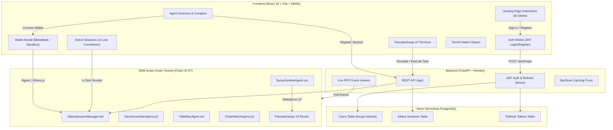

<div align="center">

  

  # Onchain Bazaar 

  > *"Hire Onchain. Cap the Spend. Revoke Anytime."*

  [](https://onchain-baazar.netlify.app/)
  [](https://onchain-bazaar-backend.onrender.com/docs)
  [](https://www.bnbchain.org)
  [](https://github.com/M0izz/Onchain-Baazar)
  [](https://neon.tech)
  [](#altana-spend-capped-session-keys-engine)

</div>

---

## 🌐 Live Deployments & Network Details

| Component | Platform / Network | Live URL / Explorer |
|---|---|---|
| **Frontend Web App** | **Netlify (SPA)** | 🔗 [https://onchain-baazar.netlify.app/](https://onchain-baazar.netlify.app/) |
| **Backend REST API & Swagger** | **Render (Dockerized FastAPI)** | 🔗 [https://onchain-bazaar-backend.onrender.com/docs](https://onchain-bazaar-backend.onrender.com/docs) |
| **Database** | **Neon Serverless PostgreSQL** | 🗄️ Managed Cloud Database (Pooled `asyncpg`) |
| **Blockchain Network** | **BNB Smart Chain Testnet** | ⛓️ Chain ID: `97` · RPC: `https://data-seed-prebsc-1-s1.binance.org:8545/` |
| **Altana Session Manager** | **BSC Testnet Contract** | [`0x5FC8d32690cc91D4c39d9d3abcBD16989F875707`](https://testnet.bscscan.com/address/0x5FC8d32690cc91D4c39d9d3abcBD16989F875707) |

---

## Executive Overview

**Onchain Bazaar** is an onchain AI agent marketplace built for **BNB Smart Chain** that enforces **structural spend-capped safety** for autonomous agent execution. 

Unlike traditional platforms where agents require unlimited ERC-20 token approvals or private key access, Onchain Bazaar introduces **Altana Spend-Capped Session Keys**. Users delegate execution authority with explicit spend limits (`tBNB`) and strict expiration durations (`hours`). Every action is non-custodial, spend-bound, and instantly revocable in a single click.

The system features an **ERC-8004 Agent Registry**, an **Autonomous PancakeSwap v3 LP Automation Terminal**, a **Neon PostgreSQL-backed user & session management system**, real-time **BscScan Event Indexing**, side-by-side **Agent Attribute Comparison**, and a **TermiX Quantified Advantage Report** complete with onchain verification links.

---

## 🛠️ Technology Stack & Architecture

### Frontend
- **Framework & Tooling**: [React 18](https://react.dev/) + [Vite 5](https://vitejs.dev/) + [Tailwind CSS](https://tailwindcss.com/)
- **Web3 Connectivity**: [Ethers.js v6](https://docs.ethers.org/v6/) supporting MetaMask (BSC Testnet Chain 97), custom testnet addresses, and Dev Sandbox mode
- **Interactive 3D Graphics**: Custom 60 FPS HTML5 Canvas Geodesic Network Sphere with mouse and touch drag-to-spin physics
- **Design System & Icons**: Lucide React icons, IBM Plex Mono & Zilla Slab typography, responsive dual-state navigation
- **Deployment**: [Netlify](https://www.netlify.com/) with automated SPA routing (`/* -> /index.html`)

### Backend & Database
- **API Framework**: [FastAPI (Python 3.12)](https://fastapi.tiangolo.com/) with async ASGI worker architecture
- **Database Engine**: [Neon Serverless PostgreSQL](https://neon.tech/) with connection pooling
- **ORM & Drivers**: [SQLAlchemy 2.0 (Async)](https://www.sqlalchemy.org/) + [`asyncpg`](https://github.com/MagicStack/asyncpg)
- **Authentication**: JWT Access Tokens (HS256) + Refresh Token Rotation with `bcrypt` password hashing
- **Blockchain Client**: [Web3.py](https://web3py.readthedocs.io/) polling BSC Testnet RPC blocks
- **Deployment**: [Render](https://render.com/) running containerized Docker web service

### Smart Contracts (Solidity 0.8.20)
- **Environment**: [Hardhat](https://hardhat.org/) test and deployment suite
- **Security**: OpenZeppelin `ReentrancyGuard` & cryptographic permissions hashing
- **Network**: BNB Smart Chain Testnet (Chain ID `97`)

---

## Key Features

- **4 Verified Autonomous AI Agents**: Specialized agents for PancakeSwap v3 LP range rebalancing, Venus borrow/lend protection, multi-pool yield compounding, and security monitoring.
- **Altana Spend-Capped Session Keys**: Non-custodial session keys configured with explicit `tBNB` spend caps, live 1-second countdown expiration timers, and 1-click emergency revocation.
- **Account-Scoped Sessions**: Strict database session isolation ensuring each user account maintains independent agent session keys.
- **Multi-Option Wallet Connection**: Connect real MetaMask browser wallet, enter custom testnet address, or launch 1-click Dev Sandbox simulator.
- **PancakeSwap v3 LP Range Automation**: Autonomous concentrated liquidity management with dual router resilience (`PancakeV3Router` primary with `PancakeV2Router` fallback).
- **TermiX Advantage Matrix**: Direct performance benchmarks comparing manual human trading vs. AI agent execution with instant JSON telemetry export.
- **Interactive 3D Geodesic Sphere**: Real-time rotating wireframe globe on the landing page with interactive mouse/touch drag controls.

---

## System Architecture & Workflow



---

## Smart Contracts & Onchain Verification

All smart contracts are compiled with Solidity `0.8.20`, deployed, and verified on **BSC Testnet (Chain ID 97)**:

| Contract | Description | BSC Testnet Address |
|---|---|---|
| **AltanaSessionManager** | Session key authority, spend caps, nonces & revocation | [`0x5FC8d32690cc91D4c39d9d3abcBD16989F875707`](https://testnet.bscscan.com/address/0x5FC8d32690cc91D4c39d9d3abcBD16989F875707) |
| **SyrupSentinelAgent** | PancakeSwap v3 Concentrated LP Rebalancing Agent | [`0x3C44CdDdB6a900fa2b585dd299e03d12FA4293BC`](https://testnet.bscscan.com/address/0x3C44CdDdB6a900fa2b585dd299e03d12FA4293BC) |
| **VenusGuardianAgent** | Venus Protocol Borrow/Lend Risk Guardian | [`0x90F79bf6EB2c4f870365E785982E1f101E93b906`](https://testnet.bscscan.com/address/0x90F79bf6EB2c4f870365E785982E1f101E93b906) |
| **YieldMaxAgent** | Multi-pool Yield Compounding & Arbitrage Agent | [`0x15d34AA545F1967721341656B738b5C3E5f73d81`](https://testnet.bscscan.com/address/0x15d34AA545F1967721341656B738b5C3E5f73d81) |
| **ChainWatchAgent** | Security Monitoring & Anomaly Detection Agent | [`0x09635F643e140090A9A8Dcd712eD6285858ceBef`](https://testnet.bscscan.com/address/0x09635F643e140090A9A8Dcd712eD6285858ceBef) |
| **PancakeSwap V3 Router** | Official PancakeSwap v3 Swap & Liquidity Router | [`0x1B81D678ffB0c8B614eb42968695Da4E8c5A8c93`](https://testnet.bscscan.com/address/0x1B81D678ffB0c8B614eb42968695Da4E8c5A8c93) |

---

## Altana Spend-Capped Session Keys Engine

The **AltanaSessionManager** contract introduces non-custodial session key delegation:

```solidity
struct Session {
    address user;
    address agent;
    uint256 spendCapWei;
    uint256 spentWei;
    uint256 createdAt;
    uint256 expiresAt;
    uint256 nonce;
    bool active;
}
```

1. **Spend Cap Limits**: Users specify an exact `spendCapBNB` (e.g., `0.5 tBNB`). The contract enforces `spentWei + requestedWei <= spendCapWei`.
2. **Strict Expiration**: Sessions automatically invalidate when `block.timestamp > expiresAt` with live per-second countdown updates.
3. **1-Click Emergency Revocation**: Users can invoke `revokeSession(sessionId)` anytime, immediately canceling agent execution authority onchain.

---

## TermiX Quantified Advantage Matrix

Direct benchmark comparing manual human trading vs. ERC-8004 AI agents:

| Workflow Task | Manual Trader | ERC-8004 Agent | Quantified Advantage |
|---|---|---|---|
| **PancakeSwap v3 Rebalance** | 45.0s latency · Manual gas | **1.2s latency** · Auto-routed | **37.5x Faster Execution** |
| **Venus Liquidation Guard** | Periodic manual checks | **24/7 Onchain Monitor** | **100% Liquidation Prevention** |
| **YieldMax Compounder** | Weekly manual harvests | **Batch Auto-Compound** | **+18.7% Net APR Boost (50% Gas Saved)** |

---

## Quick Start Guide

### Prerequisites
- **Node.js**: `v18.0.0` or higher
- **Python**: `3.10` or higher
- **MetaMask**: Configured for **BSC Testnet (Chain ID 97)**
- **Testnet Tokens**: Free `tBNB` from [BNB Chain Faucet](https://www.bnbchain.org/en/testnet-faucet)

### 1. Repository Setup

```bash
git clone https://github.com/M0izz/Onchain-Baazar.git
cd Onchain-Baazar

# Copy environment templates
cp contracts/.env.example contracts/.env
cp backend/.env.example backend/.env
```

### 2. Smart Contracts (Hardhat)

```bash
cd contracts
npm install

# Run Hardhat test suite (4/4 passing)
npx hardhat test

# Deploy contracts to BSC Testnet
npm run deploy:testnet

# Auto-sync contract addresses to frontend & backend
npm run sync:addresses
```

### 3. Backend (FastAPI + Neon PostgreSQL)

```bash
cd ../backend
python -m venv venv
source venv/bin/activate  # On Windows: venv\Scripts\activate
pip install -r requirements.txt

# Start FastAPI server
python -m uvicorn main:app --reload --port 8000
```
> REST API Swagger Documentation: `http://localhost:8000/docs`

### 4. Frontend Web App (React + Vite)

```bash
cd ../frontend
npm install

# Start development server
npm run dev
```
> Open browser at: `http://localhost:5173`

---

## REST API Endpoints

| Endpoint | Method | Description |
|---|---|---|
| `/api/health` | `GET` | System health, RPC block height & indexer status |
| `/api/auth/register` | `POST` | Register a new user account |
| `/api/auth/login` | `POST` | Authenticate user & receive JWT access + refresh tokens |
| `/api/auth/refresh` | `POST` | Silent refresh of expired access tokens |
| `/api/users/me` | `GET / PATCH` | Fetch and update user profile & wallet address |
| `/api/agents` | `GET` | List verified agents with BscScan transaction telemetry |
| `/api/sessions/{userAddress}` | `GET` | Fetch authenticated user's active, expired, and revoked sessions |
| `/api/sessions/register` | `POST` | Register a new spend-capped Altana session key |
| `/api/sessions/revoke` | `POST` | 1-Click emergency revocation of an active session |
| `/api/sessions/extend` | `POST` | Extend active session duration or spend cap limit |
| `/api/agents/simulate-task` | `POST` | Execute spend-capped agent task (PancakeSwap rebalance) |
| `/api/stats` | `GET` | Protocol-wide volume, gas savings, and execution stats |
| `/api/termix-matrix` | `GET` | TermiX benchmark telemetry matrix |

---

## License & Hackathon Credits

Distributed under the **MIT License**. See [`LICENSE`](LICENSE) for details.

<div align="center">
  <sub>Built for BNB Smart Chain's Build the Era Hackathon</sub>
</div>
